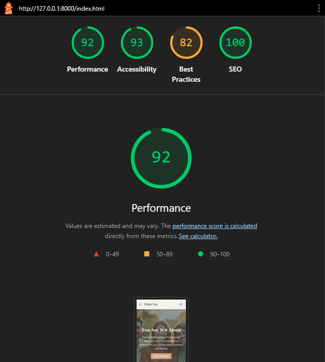
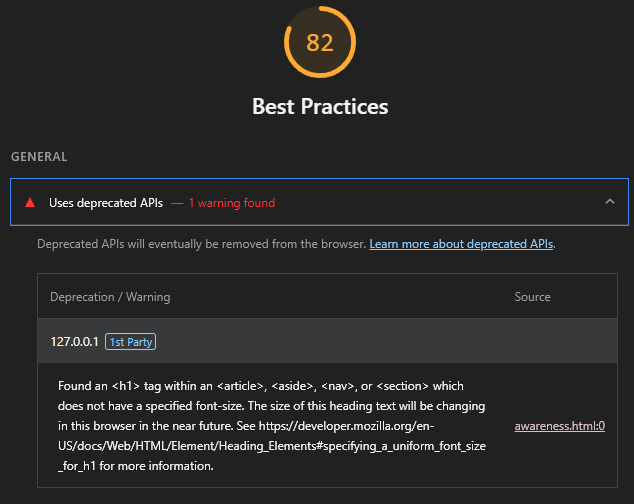
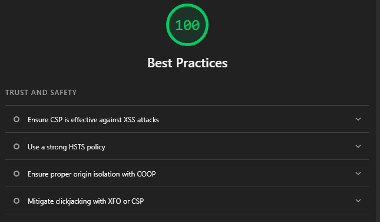

# Think You

A modern, accessible, and responsive mental health support website for the UK. This project provides immediate crisis resources, trusted organization links, and a contact form for support and feedback.

---

## Table of Contents
- [Project Overview](#project-overview)
- [Features](#features)
- [Getting Started](#getting-started)
- [Folder Structure](#folder-structure)
- [Customization](#customization)
- [Accessibility & SEO](#accessibility--seo)
- [Screenshots](#screenshots)
- [Credits](#credits)
- [License](#license)

---

## Project Overview
Think You is a fictional mental health support platform designed for demonstration and educational purposes. It features:
- Immediate crisis support box
- Resource cards for UK organizations
- Awareness and advice sections
- Contact form with modal feedback
- Responsive, accessible, and SEO-friendly design

---

## Features
- **Crisis Box:** Prominently displayed at the top of each page for urgent help.
- **Resource Cards:** Trusted UK mental health organizations, with logos and links.
- **Contact Form:** Collects user queries, triggers a modal thank-you message.
- **Responsive Layout:** Mobile-first, works on all devices.
- **Accessibility:** Skip navigation, semantic HTML, color contrast, and ARIA labels.
- **SEO:** Meta tags, descriptive alt text, and proper heading structure.

---

## Getting Started
1. **Clone the repository:**
   ```bash
   git clone https://github.com/zZWinterZz/think-you.git
   ```
2. **Open in VS Code or your preferred editor.**
3. **No build step required:** All files are static HTML/CSS/JS.
4. **To view locally:**
   - Open `index.html` in your browser, or
   - Use a local server (e.g., Live Server extension in VS Code).

---

## Folder Structure
```
think-you/
├── assets/
│   ├── css/
│   │   └── style.css
│   └── images/
│       └── [webp/png/svg icons, logos, favicons]
├── index.html
├── awareness.html
├── help-and-advice.html
├── contact.html
├── README.md
└── ...
```

---

## Customization
- **Crisis Box:** Edit the crisis box content at the top of each HTML file for your region or organization.
- **Resource Cards:** Update organization info, logos, and links in `help-and-advice.html`.
- **Contact Form:** The form is in `contact.html` and uses a modal for feedback. You can connect it to a backend if needed.
- **Branding:** Change colors and fonts in `assets/css/style.css` using CSS variables.

---

## Accessibility & SEO
- Skip navigation link for keyboard users
- Sufficient color contrast and focus states
- All images have descriptive `alt` text
- Semantic HTML5 structure
- Meta tags for description, keywords, and author

---

## Page Structure & Implementation Details

### Home Page (`index.html`)
- **Hero Section:** Large, visually engaging hero with overlay, headline, and intro text. Achieved using Bootstrap grid, custom CSS for background image and overlay.
- **Navigation Bar:** Responsive Bootstrap navbar with brand, links, and a prominent "Get Help Now" button.
- **Crisis Box:** Immediate crisis support box at the top, styled with accent color and rounded corners for visibility.
- **Footer:** Social links, disclaimer, and copyright.

### Awareness Page (`awareness.html`)
- **Awareness Content:** Sections for mental health education, using Bootstrap cards and grid for layout.
- **Call to Action:** Prominent section encouraging users to seek help, styled with Bootstrap and custom classes.
- **Crisis Box:** Consistent with other pages, always visible at the top.

### Help & Advice Page (`help-and-advice.html`)
- **Crisis Box:** Full-width, accent-colored box at the top for urgent support.
- **Resource Cards:** Grid of cards for UK organizations, each with logo, info, and a "Visit Website" button. Achieved with Bootstrap card components, custom logo sizing, and responsive grid.
- **Section Dividers:** Clear separation between resource types (e.g., children, suicide prevention) using headings and Bootstrap spacing utilities.

### Contact Page (`contact.html`)
- **Crisis Box:** Full-width, two-column layout at the top for immediate support, using Bootstrap grid and accent color.
- **Two-Column Main Section:** Left column for header/lead, right for the contact form. Responsive with Bootstrap grid.
- **Contact Form:** Collects user info, styled with custom CSS for background, border, and color. Submits trigger a Bootstrap modal for feedback.
- **Modal:** Styled to match the site’s color scheme using custom CSS.

---

**How Elements Were Achieved:**
- **Layout & Responsiveness:** Bootstrap 5 grid system, utility classes, and custom media queries.
- **Branding & Colors:** CSS variables in `style.css` for easy theme changes.
- **Accessibility:** Semantic HTML, skip navigation, ARIA labels, and color contrast.
- **SEO:** Meta tags, descriptive alt text, and proper heading structure.
- **Performance:** Optimized images (WebP), minimized inline styles, and efficient CSS.

### Screenshots
---
#### Wireframes
---
- **Home Page:**
  
- **Awareness Page:**
  
- **Help & Advice Page:**
  
- **Contact Page:**
  

---

#### Validation and Testing
---
- **Initial lighthouse test**


- **I was not happy with best practices**

- **On inspection I found that I was using the wrong link for font awesome so fixed it and re-tested**

---

## Credits
- [Bootstrap 5](https://getbootstrap.com/)
- [Font Awesome](https://fontawesome.com/)
- [Google Fonts - Roboto](https://fonts.google.com/specimen/Roboto)
- All logos and content are for demonstration only.

---

## License
This project is for demonstration and educational purposes only. Not for commercial use.

---